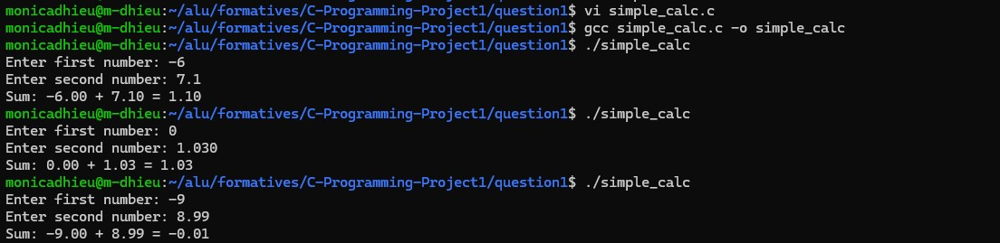

# QUESTION 1: C PROGRAM LIFECYCLE AND COMPILATION

---

## What the program does

This program takes two numbers from the user and adds them together.  
The result is printed with 2 decimal places.

---

## [View source code](simple_calc.c)

---

## 

---

## Real-world application of C programming

C programming is used in embedded systems like sensors, microcontrollers, and automotive systems.  
For example, temperature sensors in devices use C to read data and control heating or cooling systems because it is fast and uses low memory.

---

## Syntax vs Semantic Errors

### Syntax Errors
These occur when C language rules are broken ,e.g., missing semicolon or missing parenthesis in printf.
In this case the program will not compile until syntax errors are fixed.  

### Semantic Errors
Semantic errors occur when the code syntax is correct but the logic is wrong.  
In this case the program will compile and run, but it produces incorrect results.  
For example, using * instead of + in a sum calculation.  

---

## C Compilation Process

When compiling using:

`gcc simple_calc.c -o simple_calc`

The following stages happen:

### 1. Preprocessing
- Handles #include statements like stdio.h

### 2. Compilation
- Converts C code into assembly language

### 3. Assembly
- Converts assembly into machine code (object file)

### 4. Linking
- Combines object files and libraries
- Produces the final executable file (simple_calc)

---

## Note

The command `gcc simple_calc.c -o simple_calc` automatically runs all compilation stages and produces the final executable program.
