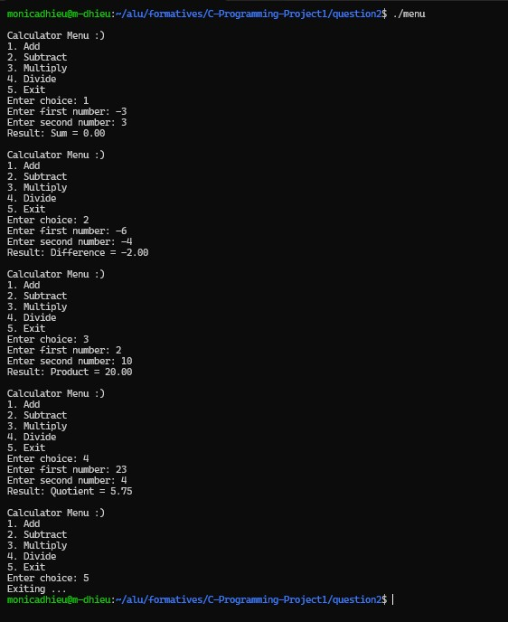

# QUESTION 2: CONTROL FLOW & REPETITION

---

## Overview
This program is a menu-driven calculator that allows the user to perform basic arithmetic operations such as addition, subtraction, multiplication, and division.

It demonstrates control flow using loops, conditionals, switch statements, break, and continue.

---

## Program logic

The program displays a menu and asks the user to select an operation.

A `while` loop is used so the program keeps running until the user chooses to exit.

A `switch` statement handles the different menu options (1–4), each calling a separate function for the arithmetic operations.

If the user enters an invalid option, an `if` statement displays an error message and the `continue` statement skips the rest of the loop.

The `break` statement is used to exit the program when the user selects option 5.

Division by zero is also handled to prevent runtime errors.

---

## Control structures used

- **while loop** - keeps program running until exit  
- **if statement** - validates input and handles errors  
- **switch statement** - selects arithmetic operation  
- **break** - exits program  
- **continue** - skips invalid input or error cases  

---

## Functions used

- menu()
- getChoice()
- getNumber()
- add()
- subtract()
- multiply()
- divide()
- validChoice()
- displayResult()

---

## [View source code](menu.c)

---

## Sample imput and output 

