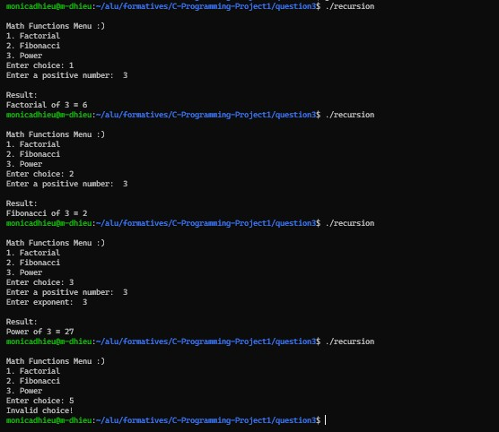

# Question 3: FUNCTIONS & RECURSION

---

## Overview

This program demonstrates modular programming using multiple functions and recursion.  
It provides 3 mathematical operations: factorial (recursive), fibonacci (recursive), and power (iterative).

The program is structured to improve readability, reuse, and separation of logic.

---

## Functions used

1. menu() - displays menu options to the user (void)
2. getChoice() - reads user's choice (returns int)
3. getNumber() - gets and validates positive input (returns int)
4. factorial() - recursive function to calculate n! (returns int)
5. fibonacci() - recursive function for Fibonacci sequence (returns int)
6. power() - iterative function for exponent calculation (returns int)
7. displayResult() - displays formatted output (void)
8. validChoice() - Validates menu input (returns int)

---

## Function reuse demonstrated

- getNumber() is reused for both base number and exponent input
- displayResult() is reused for all 3 operations
- getChoice() and validChoice() are used together for menu handling and validation

---

## Recursive functions

### Factorial(int n)
- Base case: if (n <= 1) return 1
- Recursive case: return n * factorial(n - 1)

Example:
factorial(3) = 3 × 2 × 1 = 6

---

### Fibonacci(int n)
- Base case: if (n <= 1) return n
- Recursive case: return fibonacci(n-1) + fibonacci(n-2)

Example:
fibonacci(3) = 0, 1, 1, 2 (returns 2)

---

## Advantages of recursion

- Makes code more readable and closer to mathematical definitions
- Useful for problems that naturally break into smaller subproblems
- Reduces complex loop structures
- Helpful in algorithms like divide-and-conquer
- Improves clarity for mathematical computations like Factorial and Fibonacci

---

## Limitations of recursion

- Uses more memory due to function call stack
- Can cause stack overflow for large inputs
- Slower than loops due to repeated function calls
- Difficult to debug with deep recursive calls
- Inefficient for Fibonacci due to repeated calculations

---

## When to use recursion vs Loops

Use recursion when:
- The problem has a natural recursive structure
- Clarity is more important than performance
- Input size is small or controlled

Use loops when:
- Performance and efficiency are important
- Large input sizes are expected
- Simple repetition is needed

---

## Summary

In this program, factorial() and fibonacci() use recursion to demonstrate mathematical problem-solving, while power() uses iteration for efficiency. The program demonstrates clean modular design through function reuse and separation of concerns.

## [View source code](recursion.c)

---

## Sample output 

