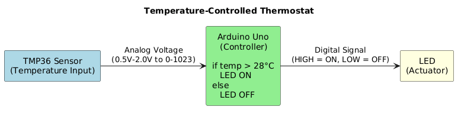
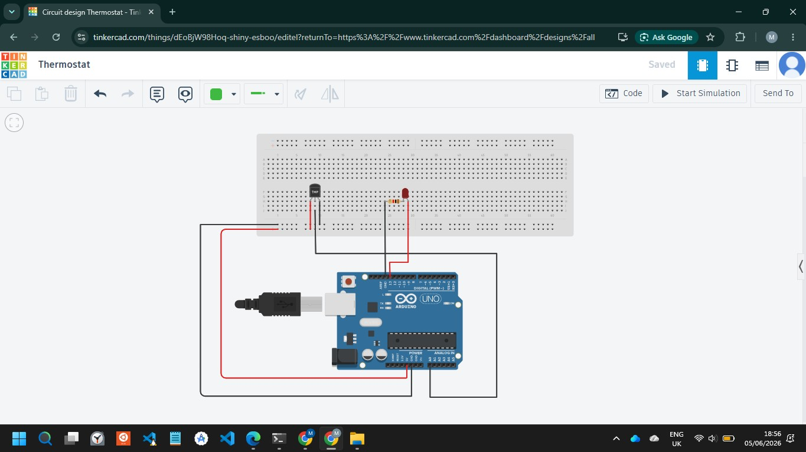
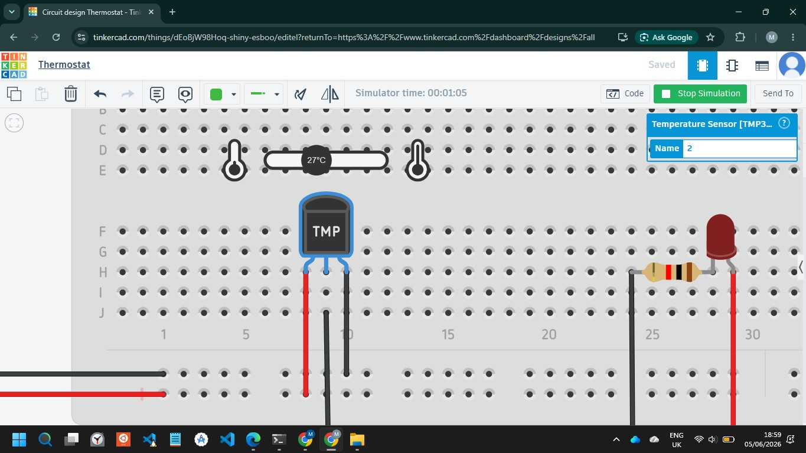
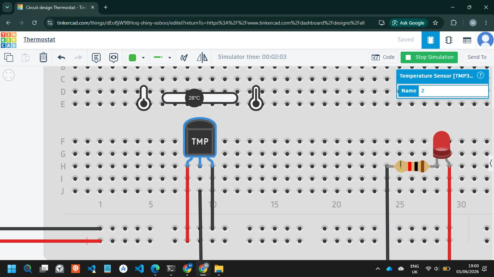

# QUESTION 4: EMBEDDED SYSTEMS

---

## Application: temperature-controlled thermostat

This project demonstrates a simple embedded system that monitors temperature and controls an output device (LED) based on a threshold of 28°C.
The system functions as a basic thermostat.
The sensor continuously measures temperature, and the Arduino processes this data in real time. If the temperature exceeds 28°C, the LED turns ON. Otherwise, it remains OFF.

This demonstrates how embedded systems combine hardware and software to automate real-world decisions.

---

## Components used

- Sensor: TMP36 temperature sensor  
- Controller: Arduino Uno  
- Actuator: LED  
- Supporting component: breadboard and resistor  

---

## Circuit description

The TMP36 sensor is connected to the Arduino as follows:
- VCC → 5V  
- Output → A0  
- GND → GND  

The LED is connected through a 220Ω resistor to digital pin 13.

The breadboard is used to organize and connect components without soldering.

---

## Data flow

1. Sensor reads ambient temperature  
2. Sends analog signal to Arduino  
3. Arduino converts signal to Celsius  
4. Compares value to 28°C threshold  
5. Controls LED based on condition  

---

## Block diagram

---

## [View pseudocode](pseudocode.txt)

---

## [View Arduino code](arduino.ino)

---

## Circuit diagram

---

## Temperature below 28 °C

 

---

## Temperature at 28°C 

---

## Temperature above 28°C

  

---

## Conclusion

This project demonstrates the integration of a sensor, controller, and actuator in a working embedded system that responds to environmental changes.

